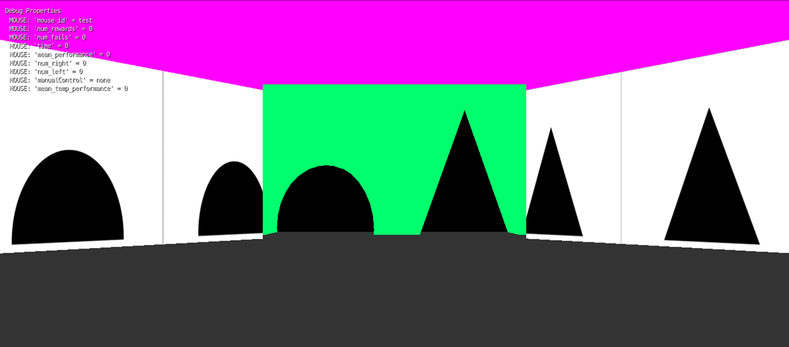
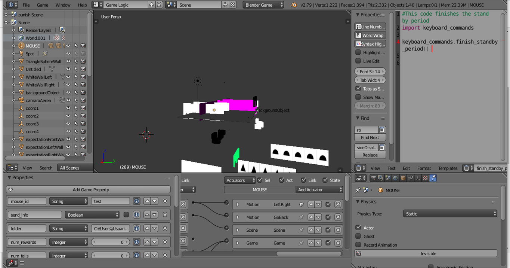

# Virtual Reality Environment

Blender code for a virtual reality environment implementing a basic Two-Alternative Forced Choice task. 

The environment is designed to be displayed in 3 monitors, thus providing a more realistic experience to the subject.

A triangle and a semi-circle are randomply displayed on the left and right of the front wall.

The subject has to move (with the mouse or keyboard arrows) along the corridor towards the rewarded shape (the semi-circle by default).

### Prerequisites

* Blender 2.79.

### Installing

Just download the repository and a Blender version lower than 2.8 (which does not support the game engine).

### Details

All relevant parameters are specified via the VRparams.txt stored in the folder corresponding to the sobject. 

The present code implements the most basic instance of the protocol, and so some of the parameters (e.g. texture) or scripts (e.g. to control the water pump) are not necessary. [the serial module (necessary to control e.g. the pump) is actually not imported because it requires some extra dependencies]

The only change that will be required for the the environment to run is to update the folder property associated to the MOUSE object, and potentially the name of the subiect (mouse_id).

After pressing P, a black screen will be shown and the user will be able to start the training pressing X.

### Authors
* [Manuel Molano](https://github.com/manuelmolano).

